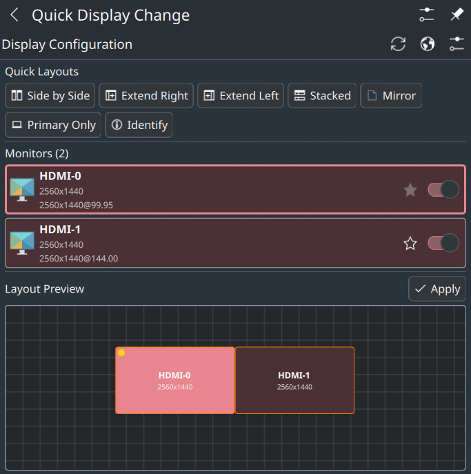
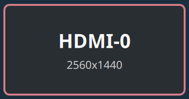
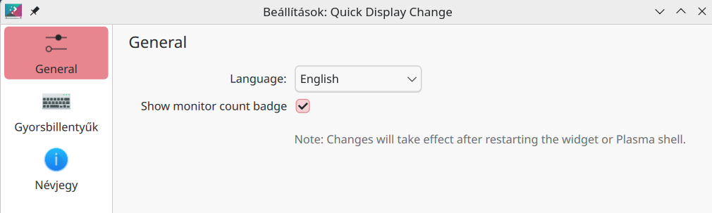

# Quick Display Change Widget

A KDE Plasma 6 widget for quick monitor configuration using kscreen-doctor.



## Features

- **Quick Monitor Toggle**: Enable/disable monitors with a single click
- **Layout Presets**: Side by Side, Extend Right/Left, Stacked, Mirror, Primary Only
- **Drag & Drop Layout Editor**: Visual positioning of monitors
- **Monitor Identification**: Show monitor names on each display
  
- **Primary Display Selection**: Set any monitor as primary
- **Multi-language Support**: 16 languages included
- **Badge Counter**: Optional monitor count badge on panel icon
  

## Requirements

- KDE Plasma 6.0 or later
- kscreen-doctor (part of libkscreen)

## Installation

### From KDE Store
[](https://store.kde.org/p/2331007/)

1. Right-click on your panel
2. Select "Add Widgets..."
3. Click "Get New Widgets..." > "Download New Plasma Widgets..."
4. Search for "Quick Display Change"
5. Click Install

Or download directly: https://store.kde.org/p/2331007/

### Manual Installation
```bash
kpackagetool6 -t Plasma/Applet -i quick-display-change.plasmoid
```

### From Source
```bash
git clone https://github.com/izll/plasma-quick-display-change.git
cd plasma-quick-display-change
kpackagetool6 -t Plasma/Applet -i .
```

## Usage

1. Add the widget to your panel or desktop
2. Click the widget icon to open the popup
3. Use the switches to enable/disable monitors
4. Use layout buttons for quick arrangements
5. Open "Layout Preview" for drag & drop positioning

## Configuration

Right-click on the widget and select "Configure..." to access:
- **Language**: Choose from 16 languages or use system default
- **Show monitor count badge**: Toggle the badge on the panel icon



## Supported Languages

- English, Magyar, Deutsch, Français, Español
- Italiano, Português (Brasil), Русский, Polski
- Nederlands, Türkçe, 日本語, 한국어
- 简体中文, 繁體中文

## File Structure

```
quick-display-change-widget/
├── metadata.json           # Widget metadata
├── contents/
│   ├── ui/
│   │   ├── main.qml              # Main widget entry point
│   │   ├── CompactRepresentation.qml  # Panel icon
│   │   ├── FullRepresentation.qml     # Popup content
│   │   ├── LayoutEditor.qml      # Drag & drop editor
│   │   ├── MonitorDelegate.qml   # Monitor list item
│   │   ├── IdentifyWindow.qml    # Monitor identification overlay
│   │   ├── CommandRunner.qml     # kscreen-doctor executor
│   │   ├── Translations.qml      # Multi-language support
│   │   └── configGeneral.qml     # Settings page
│   ├── config/
│   │   ├── main.xml              # Configuration schema
│   │   └── config.qml            # Config page loader
│   └── icons/
│       ├── monitors.svg          # Main widget icon
│       └── monitor-single.svg    # Single monitor icon
└── screenshots/                 # Preview images
```

## Technical Details

### How it Works

The widget uses `kscreen-doctor` to query and modify display configuration:
- `kscreen-doctor --outputs` - Get current monitor state
- `kscreen-doctor output.<name>.enable` - Enable monitor
- `kscreen-doctor output.<name>.disable` - Disable monitor
- `kscreen-doctor output.<name>.position.<x>,<y>` - Set position
- `kscreen-doctor output.<name>.primary` - Set as primary

### Configuration Storage

Settings are stored via Plasmoid.configuration:
- `language`: Selected language code (default: "system")
- `showBadge`: Show monitor count badge (default: true)

## License

GPL-3.0-or-later

## Author

izll

## Version History

### 1.0.1 (2025)
- Added version number display in settings dialog
- Added "Expand for better view" hint when Layout Preview is small
- Improved monitor rectangle scaling in Layout Editor
- Adjusted popup size for better responsiveness
- Added KDE Store link to widget metadata

### 1.0.0 (2025)
- Initial release
- Multi-monitor support
- 16 language translations
- Drag & drop layout editor
- Quick layout presets
